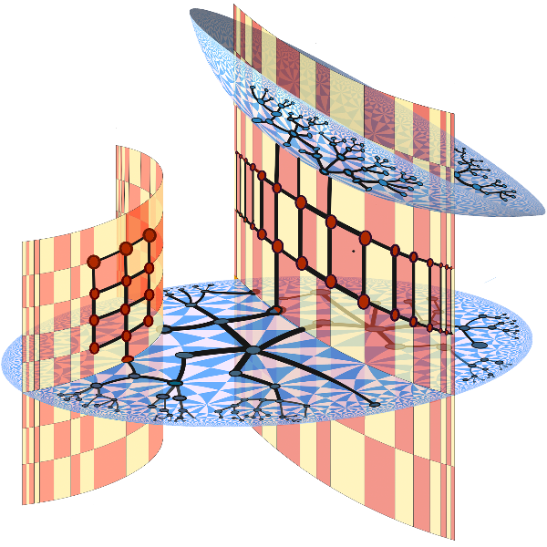
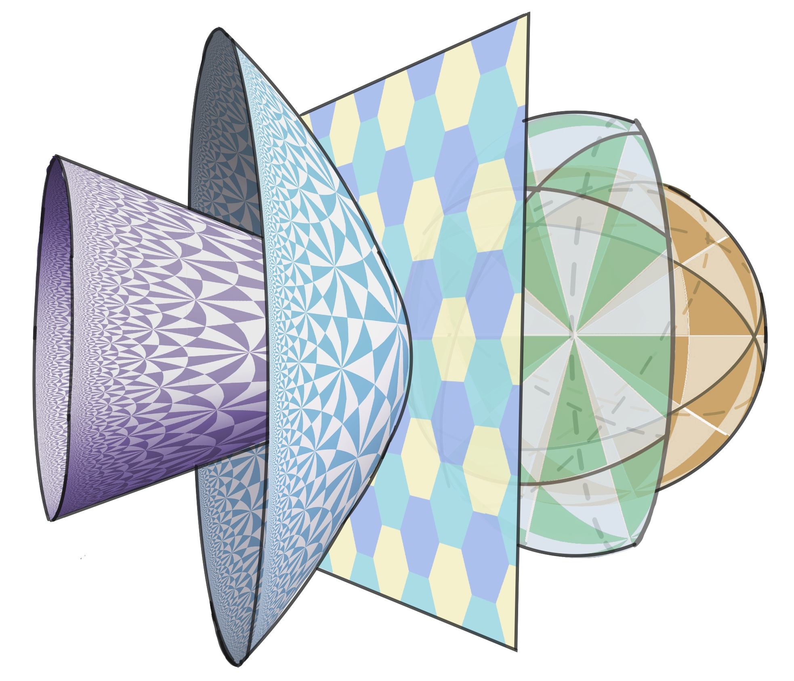

# sympa
Embeddings graphs in **sym**metric s**pa**ces.  
Code for the papers ["Symmetric Spaces for Graph Embeddings: A Finsler-Riemannian Approach"](https://arxiv.org/abs/2106.04941) published at ICML 2021, 
and the paper ["Hermitian Symmetric Spaces for Graph Embeddings"](https://arxiv.org/abs/2105.05275) published at DiffGeo4DL @ NeurIPS 2020.

<p align="middle">
  
  
</p>

#### Available Models
Vector models:
 * `euclidean`
 * `poincare`
 * `lorentz`
 * `sphere`
 * `prod-hysph`: Product of hyperbolic x sphere
 * `prod-hyhy`: Product of hyperbolic x hyperbolic
 * `prod-hyeu`: Product of hyperbolic x euclidean
 
Matrix models:
 * `spd`: Symmetric positive definite matrices space
 * `upper`: Upper half space model of the Siegel space
 * `bounded`: Bounded domain model of the Siegel space
 * `dual`: Compact dual

The last three allow different metrics

#### Available metrics
 * `riem`: Riemannian metric
 * `fone`: Finsler One
 * `finf`: Finsler Infinity
 * `fmin`: Finsler metric of minimum entropy
 * `wsum`: Learns weights for a weighted sum of the vector-valued distance
 

## Requirements
 - Python == 3.7 
 - Pytorch == 1.5.1: ```conda install pytorch==1.5.1 torchvision==0.6.1 [cpuonly | cudatoolkit=10.2] -c pytorch```.
    In CPU environments, data parallel is not stable with pytorch >= 1.6 
 - [Geoopt](https://github.com/geoopt/geoopt) >= 0.3.1: install from repository is advised: ```pip install git+https://github.com/geoopt/geoopt.git```
 - [XiTorch](https://github.com/xitorch/xitorch): for working with the compact dual only
 - networkx and networkit: for preprocessing only
 - matplotlib: for preprocessing only
 - tensorboardx
 - tqdm
 
## Running experiments

### 1. Preprocess Data

In all preprocessing cases, the option `--run_id=RUN_ID` is required. The data will be saved in `data/RUN_ID`.
If `--plot_graph` is passed, a plot will be generated, but the plotting can take a long time if the graph is large.

**Grids:**
```
python preprocess.py --graph=grid --grid_dims=DIMS --nodes=NODES --run_id=RUN_ID 
```
It will create a grid of `DIMS` dimensions with `int(NODES^(1/DIMS))` nodes.  
Ex: `python preprocess.py --graph=grid --grid_dims=3 --nodes=27` will create a 3x3x3 cube graph

**Trees**
```
python preprocess.py --graph=tree --tree_branching=BRANCHING --tree_height=HEIGHT --run_id=RUN_ID 
```
It will create a tree with branching factor `BRANCHING` and height `HEIGHT`.

**Cartesian or Rooted products**

By default it will create a cartesian/rooted product of a tree and a grid, but it can be modified by changing the 
order in the code
```
python preprocess.py --graph=product-cartesian --grid_dims=DIMS --nodes=NODES --tree_branching=BRANCHING --tree_height=HEIGHT --run_id=RUN_ID 
```
It will create a cartesian (rooted with `--graph=product-rooted`) product of the specified tree and grid.

**Social Networks**
```
python preprocess.py --graph=TYPE --run_id=RUN_ID 
```
Current available options are `social-karate`, `social-davis`, `social-florentine`, `social-miserables`.
See [NetworkX doc](https://networkx.org/documentation/stable/reference/generators.html?highlight=social#module-networkx.generators.social)

**Expanders**
```
python preprocess.py --graph=TYPE --nodes=NODES --run_id=RUN_ID 
```
Current available options are `expander-margulis`, `expander-chordal`, `expander-paley`.
See [NetworkX expanders doc](https://networkx.org/documentation/stable/reference/generators.html?highlight=social#module-networkx.generators.expanders)

**Custom**
```
python preprocess.py --graph=NAME --run_id=RUN_ID 
```
It will look for a file in `data/NAME/NAME.edges` where the graph should be represented as:
```
src_node1 dst_node1 [weight1]
src_node2 dst_node2 [weight2]
... 
```
where `src_node` and `dst_node` are `int` values and `weight` is an optional `float` value.

### 2. Train Graph Embeddings
```
python -m torch.distributed.launch --nproc_per_node=N_CPUS --master_port=2055 train.py \\
            --n_procs=N_CPUS \\
            --data=PREP \\
            --run_id=RUN_ID \\
            --results_file=out/results.csv \\
            --model=MODEL \\
            --metric=riem \\
            --dims=4 \\
            --learning_rate=1e-2 \\
            --val_every=25 \\
            --patience=50 \\
            --max_grad_norm=100 \\
            --batch_size=2048 \\
            --epochs=1000
```
Experiments can be run distributed over multiple CPUs/GPUs with `N_CPUS`. 
`PREP` must be the name of the graph to embed (what in step 1 was called `RUN_ID`).
Results will be reported in `results_file` with `run_id` as the name.
For `model` and `metric` see [Available Models](#available-models)
 
 
## Considerations
The method `inner` is implemented for both the Upper Half space and the Bounded domain model.
With this, experiments can be run with `RiemannianAdam`.
However, we found them to be very unstable, therefore all experiments reported in the paper were run with `RiemannianSGD`


## TODO
- [ ] Fix broken tests
- [ ] Add Finsler Metrics to SPD manifold
- [ ] Merge branch with Recommender System experiments into master
- [ ] Merge branch with ploting tools into master

## Citation
The source code and data in this repository aims at facilitating the study of graph embeddings in symmetric spaces. 
If you use the code/data, please cite it as follows:
```
@InProceedings{lopez2021symmetric,
  title =    {Symmetric Spaces for Graph Embeddings: A Finsler-Riemannian Approach},
  author =       {Lopez, Federico and Pozzetti, Beatrice and Trettel, Steve and Strube, Michael and Wienhard, Anna},
  booktitle =    {Proceedings of the 38th International Conference on Machine Learning},
  pages =    {7090--7101},
  year =     {2021},
  editor =   {Meila, Marina and Zhang, Tong},
  volume =   {139},
  series =   {Proceedings of Machine Learning Research},
  month =    {18--24 Jul},
  publisher =    {PMLR},
  pdf =      {http://proceedings.mlr.press/v139/lopez21a/lopez21a.pdf},
  url =      {http://proceedings.mlr.press/v139/lopez21a.html}
}
```
